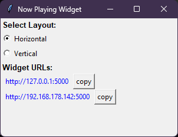

[](https://ko-fi.com/K3K314GUP)

## obs-now-playing-widget-windows-api

### Download prebuild binary (.exe) version which is ready to run:

[Download v1.0.0](https://github.com/Crypto90/obs-now-playing-widget-windows-api/releases/download/1.0.0/obs_now_playing_widget_windows_media_api.zip)

### Horizontal preview:


### Vertical preview:


### UI window preview:



### Custom CSS preview (OBS Studio):

```
body { background-color: rgba(0, 0, 0, 0); margin: 0px auto; overflow: hidden; }

.widget {
background-color: rgba(0, 0, 0, 0.95);
border-radius: 15px;
}

.progress-bar {
background-color: green !important;
height: 6px !important;
}

.progress {
height: 6px !important;
}

#cover {
border: 2px solid green;
border-radius: 15px;
}
```

This python script runs a flask webserver and parses via the windows media api current playing media informations and visulize it in a dynamic player template which can be added as a browser source to your obs overlay.

Comes with a dynamic horizontal and vertical template.
The widget automatically hides (fades out) itself in case its not in "playing" state and shows (fades in) itself when it returns back to "playing".

## How to run
To run the script, install python and run the cmd command in the same folder as the script:

python python obs_now_playing_widget_windows_media_api.py
