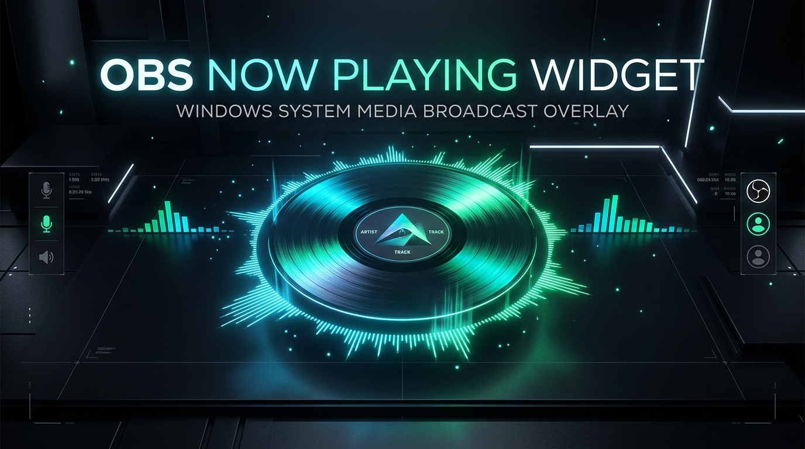
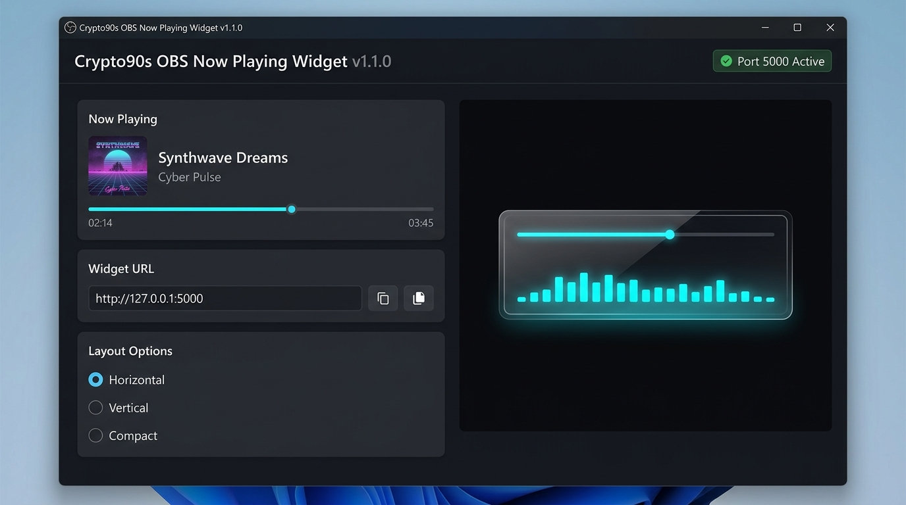

<div align="center">



# 🎵 Crypto90's OBS Now Playing Widget

**Broadcast-Ready Windows GSMTC Media Player Overlay for OBS Studio & Streamlabs**

[](https://github.com/Crypto90/obs-now-playing-widget-windows-api/releases)
[](https://github.com/Crypto90/obs-now-playing-widget-windows-api)
[](./LICENSE)
[](https://www.python.org/)
[](https://github.com/Crypto90/obs-now-playing-widget-windows-api/actions)
[](https://ko-fi.com/crypto90)

<p align="center">
  <a href="#-download-pre-built-executable"><b>Download Executable</b></a> •
  <a href="#-key-features"><b>Key Features</b></a> •
  <a href="#-screenshot"><b>UI Preview</b></a> •
  <a href="#-obs-studio-setup-guide"><b>OBS Setup Guide</b></a> •
  <a href="#-custom-css-styling"><b>Custom CSS</b></a> •
  <a href="#-how-it-works"><b>How It Works</b></a> •
  <a href="#-building-from-source"><b>Build Guide</b></a>
</p>

</div>

---

## 💡 Overview

Displaying what song you are listening to on your live stream usually requires painful third-party bot integrations, Spotify developer API tokens, or invasive browser extensions that frequently disconnect.

**Crypto90's OBS Now Playing Widget** eliminates all of that by tapping directly into the native **Windows System Media Transport Controls (GSMTC)** API. It captures currently playing track metadata, high-resolution album artwork, playback status, and elapsed duration directly from the Windows kernel.

Whether you stream music through **Spotify, Apple Music, Tidal, YouTube Music (Chrome/Edge/Brave), VLC, Deezer, or SoundCloud**, this tool renders an ultra-smooth, customizable glassmorphic overlay widget inside your OBS scenes.

---

## 🚀 Download Pre-built Executable

End-users do **not** need Python installed. Standalone Windows executables are compiled automatically via GitHub Actions:

| Version | Asset | Direct Download | Platform |
| :---: | :---: | :---: | :---: |
| **v1.1.0** *(Latest)* | `Crypto90s_OBS_NowPlayingWidget.exe` | [**⬇️ Download v1.1.0 Executable**](https://github.com/Crypto90/obs-now-playing-widget-windows-api/releases/download/1.1.0/Crypto90s_OBS_NowPlayingWidget.exe) | Windows 10 / 11 (64-bit) |

> 📁 Browse all versions and changelogs in [GitHub Releases](https://github.com/Crypto90/obs-now-playing-widget-windows-api/releases).

---

## ✨ Key Features

<table>
  <tr>
    <td width="50%">
      <h3>💎 Glassmorphic Streaming Layouts</h3>
      Comes with three distinct, broadcast-ready layouts: <b>Horizontal (Banner)</b>, <b>Vertical (Card)</b>, and a brand-new ultra-minimal <b>Compact (Pill)</b> layout.
    </td>
    <td width="50%">
      <h3>⚡ 100% Offline & CDN-Free</h3>
      Self-contained Vanilla CSS and embedded vector icons. Zero external CDNs (no Bootstrap dependency) for instant, low-latency rendering in OBS even with flaky internet.
    </td>
  </tr>
  <tr>
    <td width="50%">
      <h3>🔒 Source App Locking</h3>
      Lock the widget to a specific audio application (e.g. <code>Spotify.exe</code>) so accidental background YouTube videos or Discord audio clips never hijack your stream's music display.
    </td>
    <td width="50%">
      <h3>🌊 60fps Progress & Audio Equalizer</h3>
      High-frequency sub-second interpolation ensures the progress bar glides smoothly across seconds, accompanied by animated equalizer soundwaves.
    </td>
  </tr>
  <tr>
    <td width="50%">
      <h3>🌐 Dual-PC Streaming & LAN Support</h3>
      The built-in HTTP server automatically resolves both <code>127.0.0.1</code> and your local network IP (e.g. <code>192.168.x.x</code>), allowing dedicated streaming rigs to fetch music data from your gaming PC.
    </td>
    <td width="50%">
      <h3>🛡️ Safe Dynamic Port Fallback</h3>
      Automatically detects if port <code>5000</code> is occupied by other software (e.g. AirPlay, Docker) and seamlessly allocates the next open port without crashing.
    </td>
  </tr>
  <tr>
    <td width="50%">
      <h3>🎨 Streamer Custom CSS Tokens</h3>
      Easily customize background transparency, border radius, and accent glow colors directly within OBS Studio's <b>Custom CSS</b> box using CSS variables.
    </td>
    <td width="50%">
      <h3>🖥️ Windows 11 Fluent Dark Slate GUI</h3>
      Modern desktop controller interface with live album art preview, real-time diagnostics console, and one-click URL clipboard copying.
    </td>
  </tr>
</table>

---

## 📸 Screenshot

<div align="center">
  
</div>

---

## 🎥 OBS Studio Setup Guide

1. Launch **`Crypto90s_OBS_NowPlayingWidget.exe`**.
2. In **OBS Studio**, navigate to your desired Scene and click **`+` (Add Source) -> `Browser`**.
3. Name the source (e.g., *Now Playing Widget*).
4. Enter one of the following URLs based on your chosen layout:

| Layout | Dedicated URL | Recommended Width | Recommended Height |
| :--- | :--- | :---: | :---: |
| **Horizontal (Banner)** | `http://127.0.0.1:5000/horizontal` | `640` | `140` |
| **Vertical (Card)** | `http://127.0.0.1:5000/vertical` | `320` | `460` |
| **Compact (Pill)** | `http://127.0.0.1:5000/compact` | `440` | `70` |

> 💡 **Dual-PC Streaming:** If OBS is running on a second PC, replace `127.0.0.1` with the LAN IP displayed in the desktop app (e.g., `http://192.168.1.120:5000/horizontal`).

5. Check **"Shutdown source when not visible"** and click **OK**.

---

## 🎨 Custom CSS Styling

You can easily theme the widget inside OBS Studio by pasting these snippets into the **Custom CSS** field in the Browser Source properties:

### Emerald & Neon Cyan Glow (Default Theme)
```css
:root {
  --bg-card: rgba(18, 20, 24, 0.9);
  --accent-color: #00d2ff;
  --accent-secondary: #10b981;
  --card-radius: 16px;
}
```

### Pure Transparent Floating Text
```css
:root {
  --bg-card: transparent;
  --card-border: transparent;
}
.widget-card {
  box-shadow: none !important;
}
```

### Hot Pink / Cyberpunk Vaporwave
```css
:root {
  --bg-card: rgba(20, 10, 30, 0.92);
  --accent-color: #ff007f;
  --accent-secondary: #9d00ff;
  --card-border: rgba(255, 0, 127, 0.3);
}
```

---

## 🔄 How It Works

```mermaid
flowchart TD
    A["Media Playback (Spotify / Apple Music / Browser)"] --> B["Windows GSMTC Kernel Service"]
    B -->|Async IPC Query| C["Backend Controller (WinRT SDK)"]
    C --> D["Extract Metadata, Cover Art (Base64) & Timeline"]
    
    D --> E{"App Lock Filter Configured?"}
    E -->|Source Differs| F["Ignore Background Audio"]
    E -->|Source Matches / Unlocked| G["Update Global Media State"]
    
    G --> H["Flask HTTP Server (Port 5000)"]
    H -->|/media (JSON Endpoint)| I["OBS Studio Browser Source"]
    
    I --> J["Render Glassmorphism Template"]
    J --> K["60fps Smooth CSS Progress Interpolation"]
    J --> L["Animated Audio Visualizer Equalizer"]
```

---

## 🛠️ Building from Source

### Prerequisites

- **Python 3.8+** (Windows 10 / 11 required for WinRT GSMTC media capture)
- Git

### 1. Clone Repository & Install Dependencies

```bash
git clone https://github.com/Crypto90/obs-now-playing-widget-windows-api.git
cd obs-now-playing-widget-windows-api

pip install -r requirements.txt
```

### 2. Run Locally

```bash
python obs_now_playing_widget_windows_media_api.py
```

### 3. Build Standalone Executable

**Option A (One-Click Script on Windows):**
Double-click `build_exe.bat` in the repository root.

**Option B (Manual Terminal Command):**
```bash
pyinstaller --onefile --noconsole --name "Crypto90s_OBS_NowPlayingWidget" --add-data "templates;templates" obs_now_playing_widget_windows_media_api.py
```
The compiled binary will be placed into the `dist/` directory:
```
dist/Crypto90s_OBS_NowPlayingWidget.exe
```

---

## 🤝 Contributing

Contributions, bug reports, and suggestions are warmly welcomed!
1. Fork the repository.
2. Create your feature branch (`git checkout -b feature/amazing-feature`).
3. Commit your changes (`git commit -m 'Add amazing feature'`).
4. Push to the branch (`git push origin feature/amazing-feature`).
5. Open a Pull Request.

---

## ☕ Support the Developer

If Crypto90's OBS Now Playing Widget levels up your stream production quality, please consider buying me a coffee:

<div align="center">

[](https://ko-fi.com/crypto90)

</div>

---

## 📄 License

This project is licensed under the **MIT License**. See the [LICENSE](./LICENSE) file for details.
